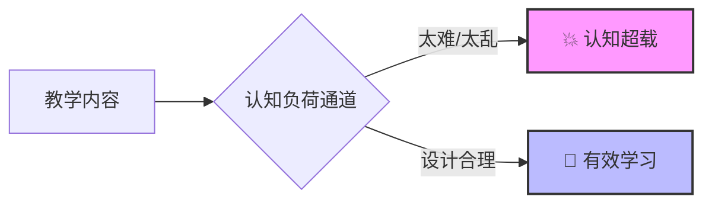
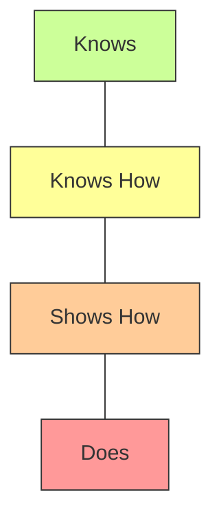

> **“我的研究结果明明很有用，为什么审稿人总说‘缺乏理论深度’？”**
>
> 这是一个非常典型的临床医生困惑。我们擅长发现问题，也擅长解决问题，但往往不擅长**解释问题**。
>
> 理论（Theory）并不是为了让文章看起来高深莫测的装饰品，而是连接“个案经验”与“普适规律”的桥梁。如果把你的教学创新比作一个身材很好的模特，那么理论就是一件合体的“外衣”——它能让你的研究在学术舞台上看起来体面、专业且有逻辑。

今天，我们精选了 5 件最适合临床医生的“学术外衣”，并附上穿搭指南。

## 第一件外衣：认知负荷理论 (Cognitive Load Theory)

**适用场景**：
*   学生抱怨“内容太多记不住”。
*   操作演示时学生手忙脚乱，顾头不顾尾。
*   PPT 密密麻麻，学生听完一脸茫然。

**理论核心**：
人的工作记忆（Working Memory）是有限的。教学设计的核心目标是：
1.  **减少外在负荷**（Extraneous Load）：去掉花哨的动画、无关的噪音。
2.  **优化内在负荷**（Intrinsic Load）：把复杂任务拆解成小块（Chunking）。
3.  **增加相关负荷**（Germane Load）：促进图式（Schema）的构建。

**穿搭指南（研究思路）**：
*   **对比研究**：对比“分段演示（降低内在负荷）”与“完整演示”在深静脉穿刺教学中的效果。
*   **测量工具**：针对深静脉穿刺这一具体任务，我们设计了如下的**《深静脉穿刺技能学习认知负荷量表》**。建议在学生观看演示并进行首次模拟操作后立即填写。

> **深静脉穿刺技能学习认知负荷量表**
>
> **指导语**：请根据刚才的学习和操作体验，圈选最符合您真实感受的分数。
>
> | 评估维度 | 具体的自我提问 (Self-Reflection) | 评分 (1-9分)   1=极低, 9=极高 |
> | :--- | :--- | :---: |
> | **1. 任务难度**   (内在负荷) | 深静脉穿刺这个操作本身（如解剖定位、穿刺角度掌握）对我来说有多难？ | 1 2 3 4 5 6 7 8 9 |
> | **2. 教学干扰**   (外在负荷) | 理解刚才的教学演示（步骤讲解、视频展示）让我感到费劲吗？ | 1 2 3 4 5 6 7 8 9 |
> | **3. 学习投入**   (相关负荷) | 我为了真正掌握穿刺的核心技巧（而不只是模仿动作）付出了多少脑力？ | 1 2 3 4 5 6 7 8 9 |
>
> *计分说明：总认知负荷 = 维度1 + 维度2 + 维度3。若对比研究中“分段演示组”的维度2（教学干扰）得分显著低于“完整演示组”，则证明教学改良有效。*

---

## 第二件外衣：刻意练习 (Deliberate Practice)

**适用场景**：
*   外科缝合、插管、腹腔镜操作等技能培训。
*   阅片、心电图判读等模式识别能力培养。

**理论核心**：
单纯的重复不是练习。有效的练习必须具备：
1.  **目标明确**（Defined Goal）。
2.  **即时反馈**（Immediate Feedback）。
3.  **走出舒适区**（Out of Comfort Zone）。

**穿搭指南（研究思路）**：
*   **干预设计**：基于**“刻意练习”**原则，我们不能只让学生“多练几遍”，而要设计一套结构化的训练方案：
    1.  **拆解动作**：将腹腔镜胆囊切除术（LC）拆解为“建立气腹”、“解剖 Calot 三角”、“夹闭切断”等独立模块。
    2.  **设定标准**：每个模块必须达到 GOALS 量表 4 分以上，才能进入下一个模块的训练。
    3.  **即时反馈**：每次练习后，导师立即对照量表指出“深度感知”或“双手配合”的具体问题。

*   **评价指标**：除了传统的“手术时间”和“并发症率”，更敏感的指标是**过程性评价量表**。

    > **推荐量表 1：GOALS (Global Operative Assessment of Laparoscopic Skills)**
    > *专为腹腔镜手术设计，评估 5 个核心维度（1-5分）：*
    >
    > | 维度 | 1分 (新手) | 3分 (合格) | 5分 (专家) |
    > | :--- | :--- | :--- | :--- |
    > | **深度感知** | 反复刺空，距离判断差 | 偶尔失误，需调整 | 准确无误，空间感强 |
    > | **双手协调** | 只用右手，左手闲置 | 左手能辅助牵引 | 双手配合流畅，如一人操作 |
    > | **组织处理** | 抓持过重，造成撕裂 | 力度适中，偶有损伤 | 极度轻柔，无不必要损伤 |
    > | **手术效率** | 动作犹豫，多余动作多 | 有计划，但在转换时停顿 | 动作果断，无无效移动 |
    > | **自主性** | 全程需导师指导 | 关键步骤需指导 | 完全独立完成 |
    >
    > **推荐量表 2：OSATS (Objective Structured Assessment of Technical Skills)**
    > *适用于开放手术及通用技能评估，包含“器械处理”、“手术流程”等 7 个维度。*

---

## 第三件外衣：成人学习理论 (Andragogy)

**适用场景**：
*   住培医生（规培生）、进修医生的教学。
*   他们不喜欢被当作小学生一样填鸭式灌输。

**理论核心**：
Malcolm Knowles 提出成人学习者有 4 个关键特征：
1.  **自我导向**：喜欢自己掌控学习节奏。
2.  **经验利用**：已有的经验是学习的基础。
3.  **内在动机**：为了解决现实问题而学（Need to know）。
4.  **问题中心**：喜欢解决问题，而不是背诵学科知识。

**穿搭指南（研究思路）**：
*   **现象解释**：为什么“翻转课堂”在规培教学中有效？因为它赋予了学生自主权（自我导向）。在课前，学生根据自己的节奏学习理论（经验利用）；在课上，通过病例讨论解决具体临床问题（问题中心）。
*   **调查研究**：设计一项横断面研究，探讨住院医师的“自主学习能力”与其临床胜任力的关系。

    > **研究工具推荐：自我导向学习准备度量表 (SDLRS)**
    > *这是一个经典的自评量表，包含 58 个条目（简版 40 个），常用于评估学习者的“内驱力”。*
    >
    > **核心维度示例（5分制：1-从不 -> 5-总是）：**
    > 1.  **学习渴望**：我希望了解新事物。（I want to learn new things.）
    > 2.  **自我管理**：我能合理安排自己的学习时间。（I can organize my time well.）
    > 3.  **独立性**：如果没人教，我自己也能学会。（I can learn without a teacher.）
    >
    > **研究假设示例**：
    > *   H1: 高年资住院医师（R3）的 SDLRS 得分显著高于低年资（R1）。
    > *   H2: SDLRS 得分高的学生，其年度考核（ITE）成绩更好。
    > *   H3: 在实施 PBL 教学改革后，学生的 SDLRS 总分有显著提升。

---

## 第四件外衣：柯氏四级评估模型 (Kirkpatrick Model)

**适用场景**：
*   所有的课程、培训项目、研讨会的效果评价。
*   **这是最常用的一件“外套”，也是最容易穿错的。**

**理论核心**：
评估培训效果有四个层次：
1.  **反应层 (Reaction)**：学员听得爽不爽？（满意度调查）
2.  **学习层 (Learning)**：学员学会了吗？（前后测成绩）
3.  **行为层 (Behavior)**：临床上用了吗？（临床行为改变）
4.  **结果层 (Results)**：病人获益了吗？（并发症下降、死亡率降低）

**穿搭指南（研究思路）**：
*   **进阶之路**：大多数临床教学研究只停留在 Level 1（满意度）和 Level 2（考试成绩）。如果你的研究能设计**3 个月后的临床回访**，收集 Level 3 的数据，你的文章档次瞬间提升。
*   **教学设计案例：手卫生依从性培训**
    *   **干预**：开展“多模式手卫生培训工作坊”（理论+荧光模拟+情景演练）。
    *   **Level 3 评估设计**：培训结束 3 个月后，派遣“神秘访客”（Secret Shopper）进入病房，在学员不知情的情况下观察其真实行为。

    > **Level 3 评估工具：WHO 手卫生依从性观察表 (简化版)**
    > *观察员记录学员在以下 5 个关键时刻是否执行了手卫生：*
    >
    > | 观察时刻 (5 Moments) | 行为记录 | 达标判定 |
    > | :--- | :--- | :--- |
    > | **1. 接触患者前** | □ 洗手 □ 擦手 □ 未执行 | 仅当选择了“洗手”或“擦手”且步骤正确时为达标 |
    > | **2. 无菌操作前** | □ 洗手 □ 擦手 □ 未执行 | 同上 |
    > | **3. 体液暴露风险后** | □ 洗手 □ 擦手 □ 未执行 | 同上 |
    > | **4. 接触患者后** | □ 洗手 □ 擦手 □ 未执行 | 同上 |
    > | **5. 接触周围环境后** | □ 洗手 □ 擦手 □ 未执行 | 同上 |
    >
    > **数据计算公式**：
    > $$ 依从性 (\%) = \frac{实际执行手卫生的次数}{应执行手卫生的总机会数} \times 100\% $$

---

## 第五件外衣：米勒金字塔 (Miller's Pyramid)

**适用场景**：
*   考核体系的设计与改革。
*   论证为什么要引入 DOPS、Mini-CEX 等形成性评价工具。

**理论核心**：
能力评估的金字塔结构：

*   **Knows**：知识储备（笔试）。
*   **Knows How**：应用知识（病例分析）。
*   **Shows How**：演示能力（OSCE）。
*   **Does**：真实表现（临床跟诊、Mini-CEX）。

**穿搭指南（研究思路）**：
*   **改革论证**：论证原有的笔试只能评估 "Knows"，无法评估 "Does"。因此引入工作场所评估（WBA）是必要的。
*   **相关性分析**：分析学生的 OSCE 成绩（Shows How）与临床轮转评分（Does）之间的一致性。

这里我留个小问题：OSCE 成绩和临床轮转评分的差异是否显著？
请读者自己设计一个研究，比较 OSCE 成绩和临床轮转评分的差异。
---

## 结语：先模仿，再内化

对于临床医生来说，教育学理论浩如烟海。不要试图一口气吃成胖子。

建议您先从这 5 个最基础、最实用的理论开始：**遇到技能问题找“刻意练习”，遇到讲课问题找“认知负荷”，遇到考核问题找“米勒金字塔”。**

先在文章里“套用”这些理论，慢慢地，它们会内化为你观察教学问题的直觉。那时，你就不是在“穿”外衣，而是拥有了真正的“学术体魄”。
