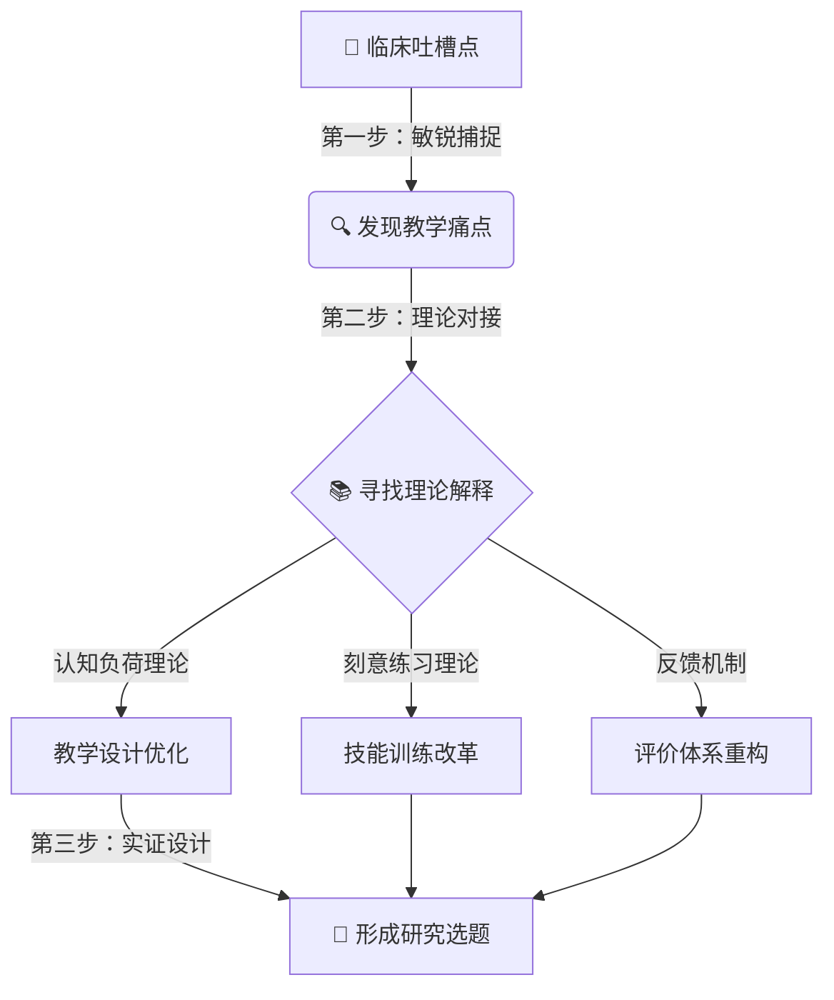

很多临床老师问我：“我想做教学研究，但实在找不到题目。每天除了查房就是带学生写病历，哪有那么多‘高大上’的课题？”

其实，**最好的研究选题，往往就藏在你最想“吐槽”的那些日常琐事里。**

今天，我分享一个简单的思维模型，帮你把临床工作中的“小麻烦”，变成科研路上的“金点子”。

## 核心思维模型：从“吐槽”到“课题”的转化路径

我们通常认为研究是从阅读文献开始的，但对于临床教师，研究应该从**现场（Gemba）**开始。

---

## 第一步：敏锐捕捉——把“抱怨”变成“问题”

我们在带教中经常会有无力感，这些时刻就是选题的富矿。

*   **场景 A**：“讲了多少遍了，换药的时候无菌观念还是没有！” —— **痛点**：传统示教效果差，技能迁移率低。
*   **场景 B**：“学生每天就在那抄病历，根本不思考鉴别诊断。” —— **痛点**：临床推理能力（Clinical Reasoning）缺乏训练。
*   **场景 C**：“交班像背书，重点抓不住。” —— **痛点**：职业沟通与信息综合能力不足。

**行动指南**：
每天下班前，在手机备忘录里记下一件让你觉得“教得累”或者“学生学不懂”的小事。积累一周，你就会发现高频痛点。

---

## 第二步：理论对接——给问题穿上“学术外衣”

光有痛点只是“发牢骚”，我们需要用教育学术语把它包装起来。

| 你的“大白话” | 对应的“学术黑话” | 可能涉及的理论 |
| :--- | :--- | :--- |
| 学生记不住步骤 | 技能保持率低 / 认知负荷过高 | 认知负荷理论、多媒体学习理论 |
| 学生只会背书，不会看病 | 知识惰性 / 临床推理能力弱 | 脚本理论、双重加工理论 |
| 老师太忙，顾不上教 | 碎片化教学 / 机会性教学 | 认知学徒制、情境学习理论 |

**为什么要做这一步？**
因为只有找到了理论支撑，你的解决方案（干预措施）才是有根之木，你的文章才能发在核心期刊上，而不是发在朋友圈里。

---

## 第三步：实证设计——从“我该怎么办”到“大家该怎么办”

最后，我们需要设计一个研究来验证你的解决方案是否有效。

这里有一个通用的**PICO**选题公式：

*   **P (Population)**：对象是谁？（实习生？规培生？低年资医生？）
*   **I (Intervention)**：你打算用什么新招？（微课？翻转课堂？模拟教学？思维导图？）
*   **C (Comparison)**：跟谁比？（传统教学法？还是历史对照？）
*   **O (Outcome)**：看什么指标？（考试成绩？操作评分？自信心量表？患者满意度？）

### 实战演练：一个选题的诞生

**1. 吐槽**：
“学生在抢救室里总是手忙脚乱，不知道该先干什么。”

**2. 转化**：
这是**非技术技能（Non-Technical Skills, NTS）**的缺失，特别是**危机资源管理（CRM）**能力的不足。

**3. 选题（PICO）**：
*   **P**: 急诊科轮转的规培医师
*   **I**: 基于原位模拟（In-situ Simulation）的CRM训练课程
*   **C**: 传统床旁带教
*   **O**: 抢救成功率（模拟）、团队协作评分（如Ottawa量表）

**最终题目**：
《原位模拟教学对急诊规培医师危机资源管理能力提升的实证研究》

---

## 结语

不要轻视你日常工作中的每一个小困惑。**所谓专家，就是把那些重复出现的“麻烦”，变成了一套可复制的“方案”。**

从今天开始，试着把你遇到的第一个教学难题，按照上面的路径推演一遍。如果你卡住了，欢迎在后台留言，我们一起帮你“诊断”！
