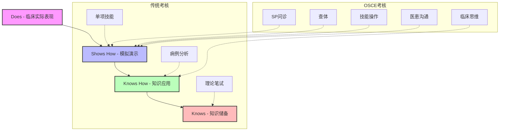

# 研究设计方案：OSCE与传统考核在消化内科住培中的应用对比

## 1. 研究问题 (Research Questions)
1. OSCE考核与传统考核（理论+操作）在评估消化内科住培学员临床能力方面是否存在显著差异？
2. 两种考核模式在米勒金字塔不同层级（Knows, Knows How, Shows How, Does）的评估效度如何？
3. 学员和考官对OSCE考核模式的接受度和满意度如何？

## 2. 理论框架 (Theoretical Framework)

本研究基于 **Miller's Pyramid (米勒金字塔)** 评估理论。

## 3. 研究对象 (Participants)
- **纳入标准**: 
  - 在我院消化内科轮转的内科住培学员（包括专硕）。
  - 轮转时间满2个月。
- **排除标准**: 
  - 轮转期间请假超过1周者。
  - 中途退培者。
- **抽样方法**: 方便抽样，拟纳入2023-2024年度学员共60-80名。

## 4. 研究方法 (Methodology)
- **研究类型**: 前瞻性对比研究 (Prospective Comparative Study)。
- **分组设计**: 自身前后对照或随机分组（建议自身对照，即所有学员均参加两种考核，比较一致性）。
  - **组A (传统模式)**: 
    - 理论考试 (40%): 闭卷笔试，含单选、多选、简答。
    - 技能操作 (60%): 随机抽取一项（如腹腔穿刺术、胃管置入术），考官评分。
  - **组B (OSCE模式)**: 设置4-6个站点。
    - 站1: 病史采集 (SP) - 消化道出血/腹痛
    - 站2: 体格检查 - 腹部查体
    - 站3: 技能操作 - 腹穿/三腔二囊管
    - 站4: 病例分析 - 肝硬化/胰腺炎诊疗计划
    - 站5: 辅助检查判读 - 腹部CT/内镜图片

## 5. 数据收集工具 (Instruments)
- **考核评分表**: 
  - 传统技能评分表 (基于执业医师标准)
  - OSCE评分表 (基于DOPS改良，包含沟通、人文关怀维度)
- **问卷调查**: 
  - 考核满意度问卷 (Likert 5级计分)
  - 胜任力自评量表

## 6. 数据分析计划 (Data Analysis Plan)
- **描述性统计**: 比较两组的平均分、及格率。
- **差异性分析**: 配对t检验（自身对照）或独立样本t检验（分组对照）。
- **相关性分析**: Pearson相关分析考察OSCE成绩与传统成绩的相关性。
- **一致性分析**: Bland-Altman图分析两种评价方法的一致性。
